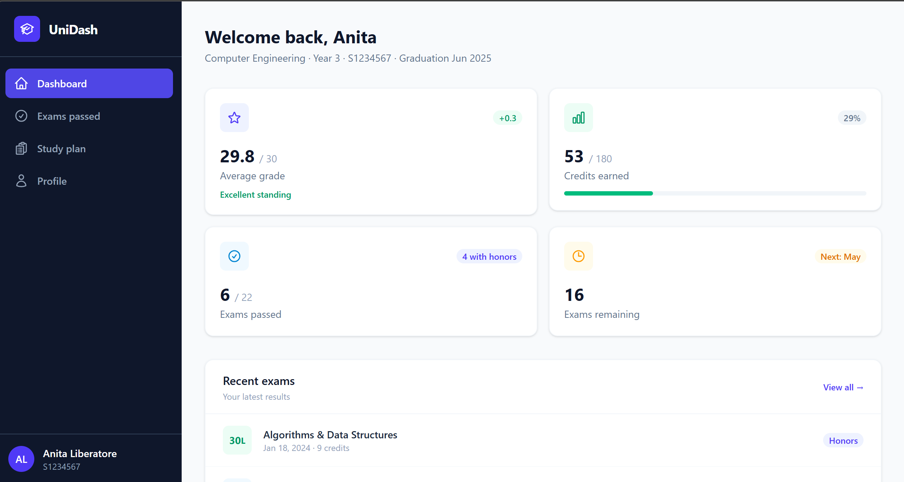

# UniDashboard FE

A modern, fully responsive university student dashboard built with **Angular 19** and **Tailwind CSS v4**. Students can track their academic progress, browse their study plan, review passed exams and manage personal documents — all from a clean, single-page interface with an animated sidebar.

---

## Screenshots

### Dashboard — Home


---

## Pages

| Route | Page | Description |
|---|---|---|
| `/` | **Dashboard** | Stat cards (GPA, credits, exams), recent results, upcoming exams |
| `/exams` | **Exams passed** | Full grade table with color-coded badges, average, honour count |
| `/study-plan` | **Study plan** | 3-year curriculum split by semester, pass/fail indicators |
| `/profile` | **Profile** | Personal info, academic record, documents, upload modal |

---

## Project structure

```
src/app/
│
├── components/          # Generic, reusable UI primitives
│   ├── sidebar/         # App navigation (fixed left rail)
│   ├── page-header/     # Page title + subtitle strip
│   ├── stat-card/       # KPI card with icon slot, progress bar, badge
│   ├── section-card/    # Titled content card with optional action slot
│   ├── pill-tabs/       # Pill-style tab switcher
│   ├── progress-item/   # Labelled progress bar row
│   └── grade-badge/     # Colour-coded grade pill (18–30L range)
│
├── custom/              # Domain-specific feature components
│   ├── profile-hero/    # Student avatar, name, quick-stat strip
│   ├── exams-table/     # Exam results table (uses grade-badge)
│   ├── year-plan-card/  # Single-year study plan card (uses grade-badge)
│   ├── document-row/    # Document list row with status badge
│   └── upload-modal/    # Drag-and-drop upload modal with progress
│
├── pages/               # Thin page orchestrators (data + layout only)
│   ├── home/
│   ├── exams/
│   ├── study-plan/
│   └── profile/
│
├── models/              # Shared TypeScript interfaces
│   ├── student.model.ts
│   ├── exam.model.ts
│   ├── course.model.ts
│   └── document.model.ts
│
├── app.routes.ts        # Route definitions
└── app.component.html   # Root shell (sidebar + router-outlet)
```

### Design principle

```
components/   ←  zero domain knowledge, zero model imports
                 (card, tab, progress bar …)

custom/       ←  use components/ + import models/
                 (exam table, upload modal …)

pages/        ←  use components/ + custom/, hold data & logic
```

---

## Tech stack

| Layer | Technology |
|---|---|
| Framework | Angular 19 (standalone components, SSR) |
| Styling | Tailwind CSS v4 (`@import "tailwindcss"`) |
| Icons | Heroicons 2.0 outline SVGs (inline) |
| Routing | Angular Router with `routerLinkActive` |
| Forms | `FormsModule` + `ngModel` |
| Server-side rendering | `@angular/ssr` + Express 4 |
| Testing | Karma + Jasmine |

---

## Quick start

```bash
# 1. Clone
git clone https://github.com/Anita-Liberatore/uni-dashboard-fe.git
cd uni-dashboard-fe

# 2. Install
npm install

# 3. Dev server  →  http://localhost:4200
npm start

# 4. Production build
npm run build
# Output: dist/uni-dashboard-fe/

# 5. SSR preview
npm run serve:ssr:uni-dashboard-fe
```

---

## Key component APIs

### `<app-stat-card>`
```html
<app-stat-card value="29.8" label="GPA" suffix="/30"
               badge="+0.3" badgeClass="text-emerald-600 bg-emerald-50"
               [progress]="66" progressClass="bg-indigo-500">
  <svg slot-icon …></svg>   <!-- projected icon -->
</app-stat-card>
```

### `<app-section-card>`
```html
<app-section-card title="Documents" [scrollableX]="true">
  <button slot-action …>Upload</button>   <!-- header right slot -->
  <!-- body content projected here -->
</app-section-card>
```

### `<app-upload-modal>`
```html
<app-upload-modal
  [isOpen]="uploadModalOpen"
  (closed)="uploadModalOpen = false"
  (uploaded)="onDocumentsUploaded($event)">
</app-upload-modal>
```
Emits `StudentDocument[]` on successful upload. Supports drag-and-drop, per-file progress bars, Escape key, and backdrop click to close.

### `<app-grade-badge>`
```html
<app-grade-badge [grade]="30" [lode]="true"></app-grade-badge>
<!-- renders "30L" in an emerald pill -->
```

---

## Contributing

- Branch naming: `feature/<name>`, `fix/<name>`, `chore/<name>`
- All source comments and commit messages in **English**
- Follow Angular Style Guide (one component per file, `OnPush` where possible)
- Open a pull request with a clear description before merging

---

## Useful links

- [Angular CLI docs](https://angular.dev/tools/cli)
- [Tailwind CSS v4 docs](https://tailwindcss.com/docs)
- [Heroicons](https://heroicons.com)

---

## License

MIT — see [LICENSE](LICENSE) for details.
